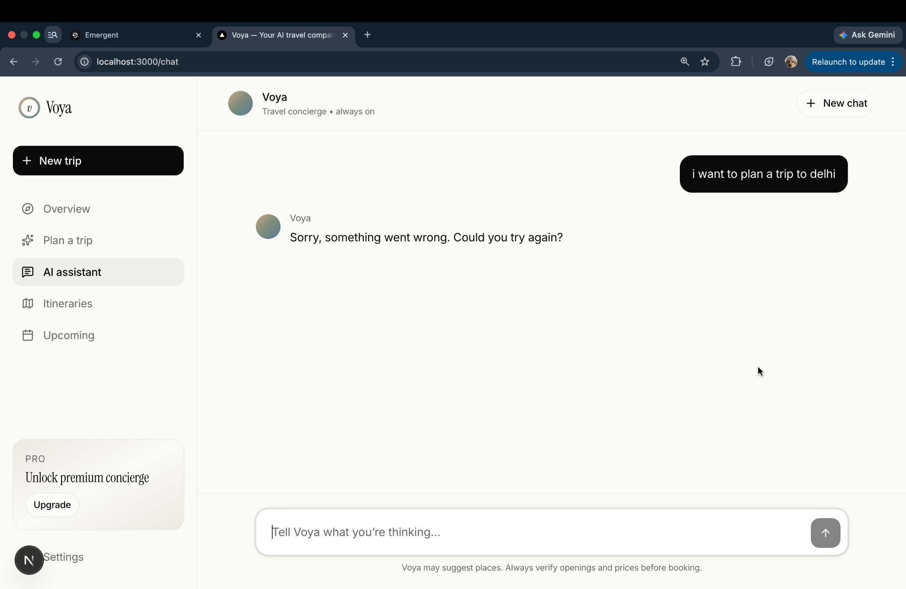
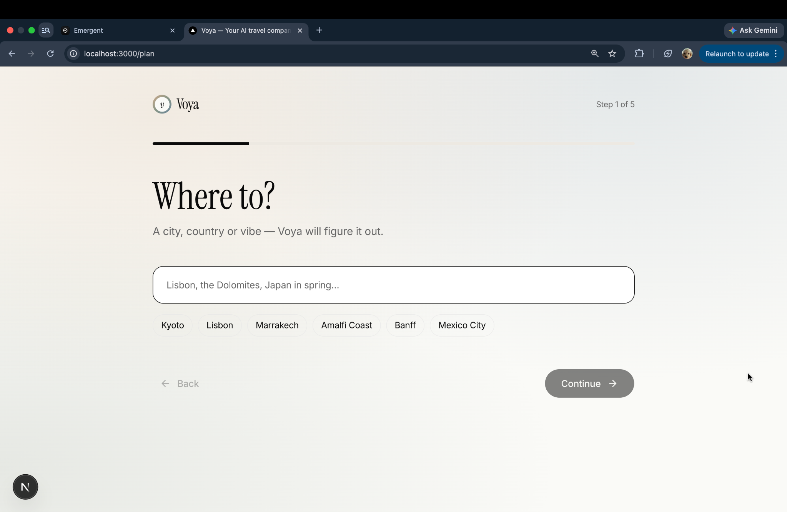
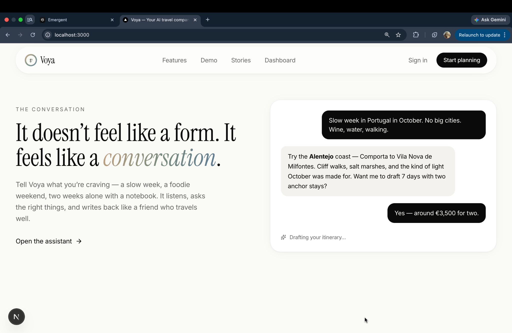
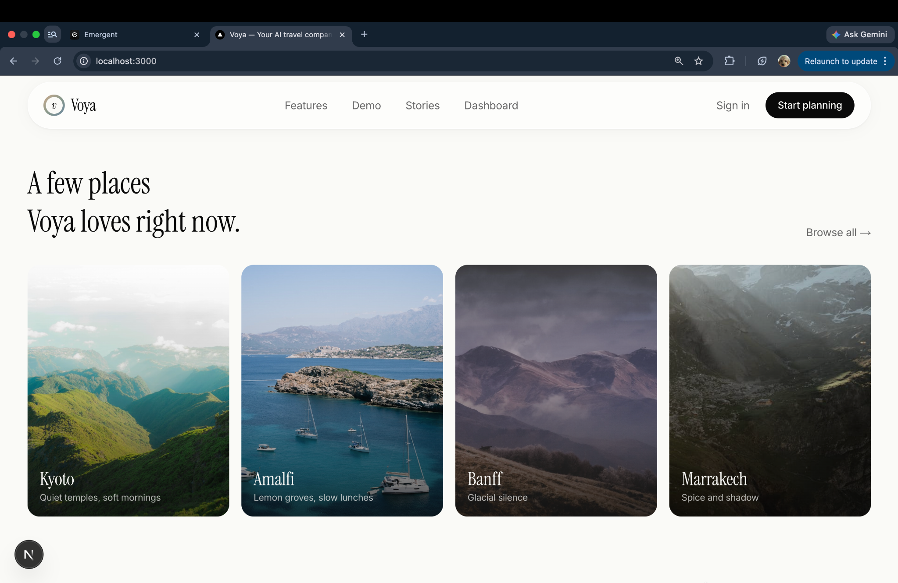
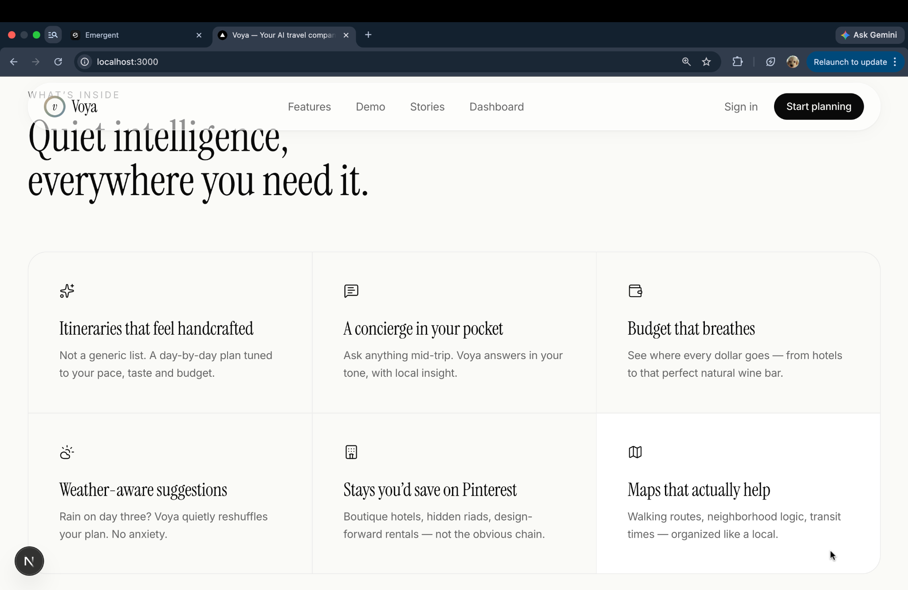

# Voya — AI Travel Companion

> **Travel, considered. Planned in minutes.**

Voya is an AI-powered travel concierge that generates personalized, day-by-day itineraries from a single sentence. It thinks like a seasoned traveler and writes like a luxury travel editor.


---

## ✨ Features

- **AI Itinerary Generation** — Describe your trip in plain English. Voya returns a full multi-day plan with real neighborhoods, restaurants, and hidden gems.
- **Conversational Assistant** — A streaming AI chat interface that refines your trip, answers mid-trip questions, and suggests alternatives.
- **5-Step Trip Wizard** — Guided planning flow covering destination, dates, budget, interests, and travel style.
- **Budget Breakdown** — See exactly where every dollar goes across flights, stays, food, and activities.
- **Saved Trips Dashboard** — All your generated itineraries in one place, with day-by-day timelines and curated stay recommendations.
- **Weather-Aware Planning** — Weather context baked into every itinerary.
- **Premium Design** — Apple-level minimalism with glassmorphism, custom typography, and smooth animations.

---

## 📸 Screenshots

### Landing Page


### AI Assistant


### Trip Planner Wizard


### Demo Section


### Destination Cards


### Features Grid


### CTA + Footer


---

## 🛠 Tech Stack

| Layer | Technology |
|---|---|
| Frontend | Next.js 16, React, Tailwind CSS v3 |
| UI Components | shadcn/ui |
| Fonts | Inter + Instrument Serif (Google Fonts) |
| Icons | Lucide React |
| Notifications | Sonner |
| AI / LLM | GPT-4o-mini via Emergent LLM API |
| Database | MongoDB |
| Streaming | SSE via ReadableStream |

---

## 🗂 Project Structure

```
voya/
├── app/
│   ├── globals.css          # Design tokens, custom utilities
│   ├── layout.js            # Root layout, fonts, toaster
│   ├── page.js              # Landing page
│   ├── api/[[...path]]/     # Catch-all API routes
│   │   └── route.js         # /chat, /itinerary, /trips
│   ├── signin/page.js
│   ├── signup/page.js
│   ├── dashboard/page.js
│   ├── plan/page.js         # 5-step wizard
│   ├── chat/page.js         # Streaming AI chat
│   └── itinerary/page.js    # Trip detail view
├── components/voya/
│   ├── Logo.jsx
│   ├── Nav.jsx              # Scroll-aware floating nav
│   └── Sidebar.jsx          # App sidebar
├── lib/
│   ├── llm.js               # streamChat + chatJSON helpers
│   └── mongo.js             # MongoDB connection
└── tailwind.config.js
```

---

## 🚀 Getting Started

### Prerequisites
- Node.js 18+
- npm
- MongoDB connection string (free tier at [mongodb.com/atlas](https://mongodb.com/atlas))
- Emergent LLM API key

### Installation

```bash
git clone https://github.com/YOUR_USERNAME/voya.git
cd voya
npm install
```

### Environment Variables

Create a `.env.local` file in the root:

```env
EMERGENT_LLM_KEY=your_emergent_llm_key
MONGO_URL=your_mongodb_connection_string
DB_NAME=voya
```

### Run locally

```bash
npm run dev
```

Open [http://localhost:3000](http://localhost:3000).

---

## 🔌 API Reference

| Method | Endpoint | Description |
|---|---|---|
| `POST` | `/api/chat` | Streaming chat completion (SSE) |
| `POST` | `/api/itinerary` | Generate + save a full itinerary |
| `GET` | `/api/trips` | List all saved trips |
| `GET` | `/api/trips/:id` | Fetch a single trip |
| `GET` | `/api/health` | Health check |

---

## 🎨 Design System

| Token | Value |
|---|---|
| `bone` | `#FAFAF7` — primary background |
| `ink` | `#0A0A0A` — primary text |
| `mist` | `#ECE9E2` — subtle surfaces |
| `clay` | `#C9A382` — warm accent |
| `sage` | `#7B8C7C` — nature accent |
| `ocean` | `#5B7A95` — cool accent |

**Fonts:** Inter (body) + Instrument Serif (display, italic headings)

**Custom utilities:** `.glass`, `.gradient-text`, `.gradient-mesh`, `.noise`, `.streaming-cursor`

---

## 🗺 Roadmap

### MVP (current)
- [x] Premium landing page
- [x] AI chat with streaming
- [x] 5-step trip planning wizard
- [x] Itinerary generation + persistence
- [x] Dashboard with saved trips
- [x] Sign in / Sign up UI

### Phase 2
- [ ] Supabase Auth — real user accounts
- [ ] Trips saved per user
- [ ] Editable itineraries
- [ ] Framer Motion page transitions
- [ ] Mobile responsive polish

### Phase 3
- [ ] Real hotel/activity data (Amadeus / Viator API)
- [ ] Live weather integration
- [ ] Trip sharing via public links
- [ ] Stripe subscriptions for Pro tier
- [ ] Deploy to Vercel

---

## 📄 License

MIT © 2025 Voya